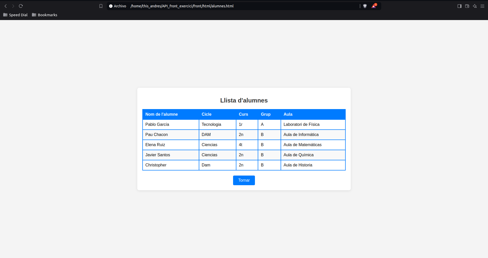
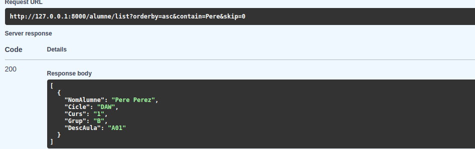
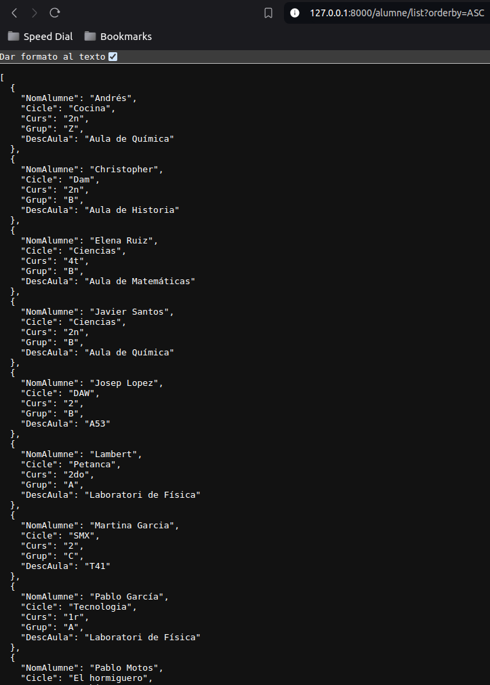
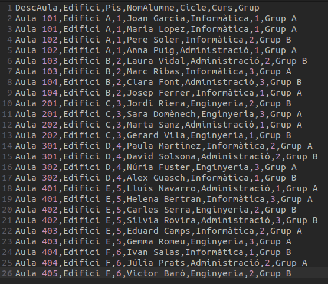
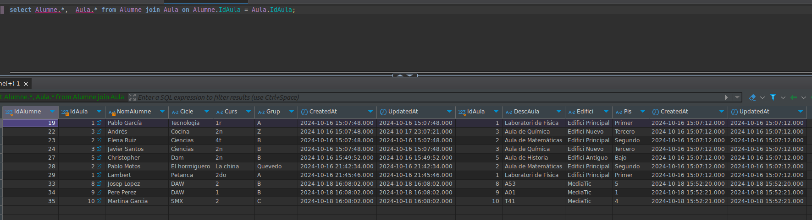
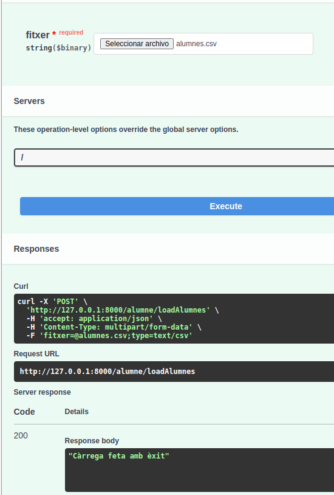
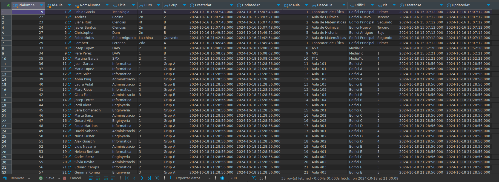

# Prova de l'apartat 1
Aquesta part és on s'ha afegit el fetch dins del fitxer script.js per conectar-se a l'API i executar el endpoint /alumne/list

# Prova de l'apartat 2
Aquesta part és on s'ha creat l'endpoint que permeten utilitzar tant els paràmeters de query, com sinó vols utilitzar-ho. En aquest cas, retornarà el mateix cas de l'apartat 
anterior però, si indiques algun paràmetre, per exemple un orderby = desc, te'ls ordenarà de manera descendent.

# Prova de l'apartat 3
Aquesta part és on es fa la càrrega a partir d'un fitxer CSV, seguint sempre que el format del CSV sigui (DescAula, Edifici, Pis, NomAlumne, Cicle, Curs, Grup), si no existeix l'aula la crea i si existeix, va directament a afegir l'alumne on també verifica si aquest alumne existeix, sinó existeix, el crea també. Finalment, li mostra a l'usuari un missatge de que el fitxer s'ha carregat correctament.

